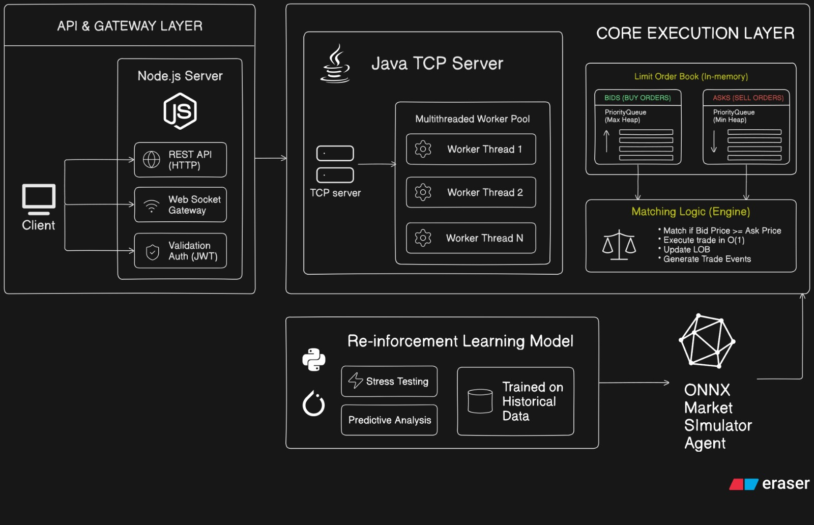
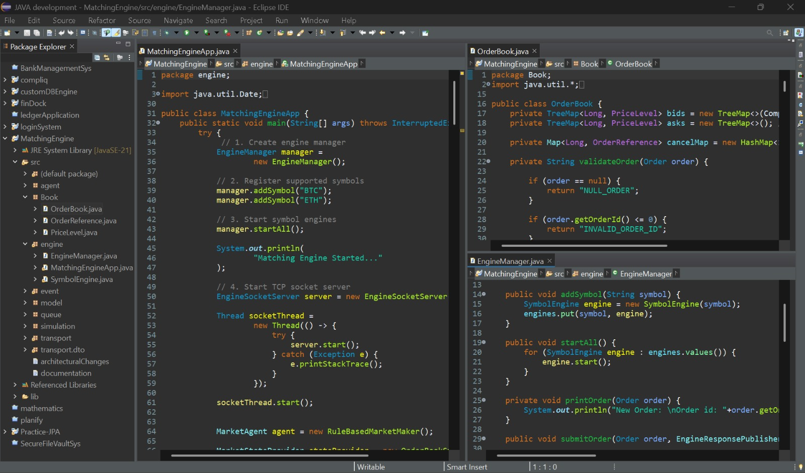
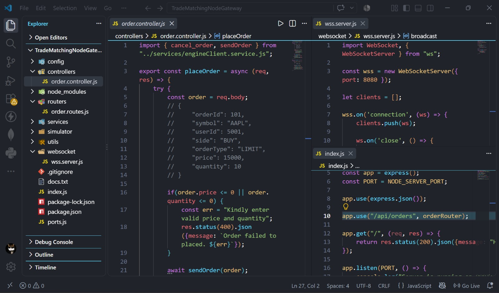
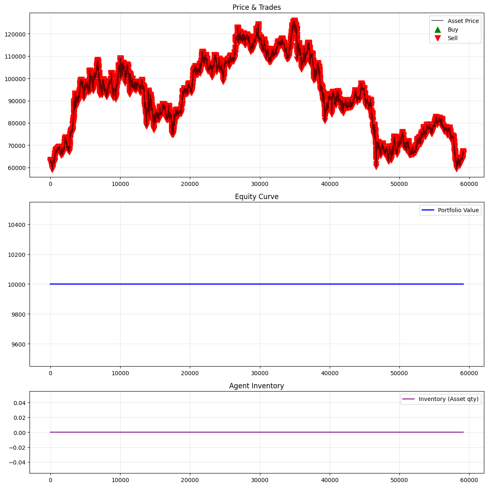

# Trade Matching Engine & RL Agent Trade simulator

Welcome to the **Matching Engine Project**. This is not just another CRUD app, it's a high-octane limit order book (LOB) exchange. I've bridged a rock-solid Java matching engine, an autonomous Python-based Reinforcement Learning (RL) trading agent, and a sleek MERN stack frontend into a single, cohesive ecosystem.

## Table of Contents

- [The Challenge](#the-challenge)
- [System Architecture](#system-architecture)
- [Technology Stack](#technology-stack)
- [Core Capabilities](#core-capabilities)
- [Getting Started](#getting-started)
- [Environment Configuration](#environment-configuration)
- [API Documentation](#api-documentation)
- [Screenshots](#screenshots)
- [Under the Hood: Design Decisions](#under-the-hood-design-decisions)
- [What's Next?](#whats-next)

## The Challenge

Building a real-time exchange is notoriously difficult. You have to process thousands of orders per second, guarantee zero race conditions, and ruthlessly enforce price-time priority. Testing these systems is equally painful because hardcoded trading bots don't behave like real market participants.

This project tackles both problems head-on. It strips away traditional locking bottlenecks by using isolated, concurrent threads for each trading symbol. On top of that, it introduces an offline-trained Reinforcement Learning agent that acts as a dynamic market maker, learning and adapting to market friction rather than just blindly firing orders.

## System Architecture

My multi-threaded, asynchronous architecture is built for speed and reliability:

1. **Transport Layer**: A lightning-fast TCP Socket Server handles incoming JSON order payloads.
2. **Engine Manager**: The central orchestrator that routes incoming trades to the correct symbol thread (e.g., BTC, ETH).
3. **Symbol Engines (Event Loop)**: Dedicated background threads per symbol ensure absolute thread-safety. Orders stream through a `LinkedBlockingQueue` sequentially, completely bypassing expensive, slow synchronization locks.
4. **Order Book**: The beating heart of the engine uses dual `TreeMap` data structures to maintain strict, unshakeable price-time priority.
5. **Simulation Layer**: Embedded hooks allow market-making agents to interface directly with the exchange. This includes a custom MLP network inference engine built purely in Java—no heavy ML bloatware required.
6. **Intelligence Layer**: A custom Python Gymnasium environment uses Proximal Policy Optimization (PPO) to train the RL agent, forcing it to juggle both live market conditions and its own portfolio state.

## Technology Stack

* **Core Engine**: Java (Sockets, Multithreading, Concurrent Collections, Jackson)
* **Intelligence Layer**: Python, `gymnasium`, `stable-baselines3`, `pandas`, `numpy`
* **Web Ecosystem**: MongoDB, Express, React, Node.js (MERN)

## Core Capabilities

* **Blazing Fast Matching**: Lock-free order execution powered by dedicated threads per symbol.
* **Flawless Priority Management**: Price-time priority maintained effortlessly in `O(log N)` time via dual TreeMaps.
* **Zero-Dependency AI Inference**: I parse and execute neural network matrix multiplications natively in Java. Zero Python dependencies at runtime.
* **Smart Autonomous Trading**: My RL agent is trained using PPO and supports fractional trading to manage risk effectively.
* **Realistic Market Dynamics**: The training simulator enforces real-world friction, including commissions, slippage, and inventory holding penalties.
* **Event-Driven Messaging**: A decoupled internal Pub/Sub system isolates matching logic from network I/O.

## Getting Started

Ready to spin up the exchange? Here is how to get all three layers running.

### 1. Launch the Java Engine
Navigate to the engine directory, compile, and run the main core:
```bash
javac engine/MatchingEngineApp.java
java engine.MatchingEngineApp
```

### 2. Train the RL Agent
Navigate to the `Python_model` directory to kick off PPO agent training on historical market data:
```bash
cd Python_model
python agents/train.py
```

### 3. Boot the MERN Interface
Start the backend and frontend servers to interact with the engine visually:
```bash
# Backend
cd backend && npm install && npm run dev
# Frontend
cd frontend && npm install && npm start
```

## Environment Configuration

Create `.env` files in your respective directories to wire everything together:

```env
# Java Engine
PORT=8080
TCP_PORT=9090

# MERN Backend
MONGO_URI=mongodb://localhost:27017/matching_engine
JWT_SECRET=your_super_secret_key

# Python Agent
DATA_PATH=./data/historical_data.csv
```

## API Documentation

The Java Engine uses a lightweight TCP Socket server for maximum throughput. Here is how you communicate with it:

**Submitting a New Order (JSON):**
```json
{
  "command": "NEW_ORDER",
  "symbol": "BTC",
  "price": 50000.0,
  "quantity": 1.5,
  "side": "BUY",
  "type": "LIMIT"
}
```

**Asynchronous Domain Events:**
The server pushes real-time events back to the client via the `EngineResponsePublisher`. Expect payloads like:
* `OrderAcceptedEvent`
* `TradeExecutedEvent`
* `OrderFilledEvent`
* `OrderRejectedEvent`

## Screenshots

Take a look at the system in action:






## Under the Hood: Design Decisions

* **Thread-Per-Symbol Concurrency**: Synchronizing an entire order book creates a massive bottleneck. Instead, we queue orders to an asynchronous event loop specific to each symbol. State mutations are guaranteed to be thread-safe and incredibly fast.
* **O(log N) Matching Algorithm**: Finding the best bid or ask needs to be instantaneous. Dual `TreeMap`s guarantee logarithmic lookup times, keeping the engine responsive even during extreme volume spikes.
* **Pure Java Inference Engine**: We refused to bloat the ultra-fast Java engine with heavy ML frameworks like TensorFlow. Neural network weights are loaded via JSON, and the forward pass is computed using raw Java math. It's lean, mean, and fast.
* **Dense RL Reward Function**: To prevent the Python agent from learning lazy "buy-and-hold" strategies, we built a complex reward function that actively balances PnL against inventory penalties and portfolio drawdown.

## What's Next?

* **O(1) Order Cancellations**: We are actively transitioning the order tracking system to an intrusive doubly-linked list to achieve instantaneous, O(1) order cancellations.
* **WebSocket Integration**: Upgrading the transport layer to WebSockets for native, real-time integration directly with the React frontend.
* **Advanced Agent Strategies**: Training the PPO agent on order book imbalance and micro-structure data rather than basic OHLCV candles to dramatically improve market-making decisions.
